# StoreyBox Diagrams (Mermaid.js)

## 1. Complete Session Flow

---

## 2. State Machine

---

## 3. Software Architecture

---

## 4. Data Flow

```mermaid
flowchart LR
    subgraph INPUT["📥 INPUT"]
        Camera[🎥 Camera]
        Mic[🎤 Microphone]
        Touch[👆 Touch Input]
    end

    subgraph CAPTURE["🎬 CAPTURE"]
        VideoStream[Video Stream]
        AudioStream[Audio Stream]
        LocalMOV[Local .mov Files]
    end

    subgraph AI_PROCESS["🤖 AI PROCESSING"]
        PromptAI[Prompt Selection AI]
        FrameAI[Frame Selection AI]
        VibeAI[Vibe Summary AI]
        BackgroundAI[Background Gen AI]
    end

    subgraph GENERATION["🎨 GENERATION"]
        Frames[Selected Frames]
        Background[Generated Background]
        QRCode[QR Code]
        StripImage[Strip Image]
    end

    subgraph OUTPUT["📤 OUTPUT"]
        Printer[🖨️ Printer]
        CloudStorage[☁️ Cloud Storage]
        WebPage[🌐 Story Page]
    end

    Camera --> VideoStream
    Mic --> AudioStream
    VideoStream --> LocalMOV
    AudioStream --> LocalMOV
    
    LocalMOV --> PromptAI
    PromptAI --> |"Next 4 Prompts"| Touch
    
    LocalMOV --> FrameAI
    FrameAI --> Frames
    
    LocalMOV --> VibeAI
    VibeAI --> BackgroundAI
    BackgroundAI --> Background
    
    Frames --> StripImage
    Background --> StripImage
    QRCode --> StripImage
    
    StripImage --> Printer
    LocalMOV --> CloudStorage
    Frames --> CloudStorage
    StripImage --> CloudStorage
    CloudStorage --> WebPage
```

---

## 5. Prompt Selection Flow

---

## 6. Strip Generation

---

## 7. Error Handling

---

## 8. Consent Flow

```mermaid
flowchart TD
    subgraph ENTRY["📍 ENTRY"]
        MomentsComplete[4 Moments Complete]
        FramesSelected[Frames Selected]
        BackgroundGenerated[Background Generated]
    end

    subgraph CONSENT_UI["✅ CONSENT SCREEN"]
        Preview[Preview Strip]
        ConsentPrompt["One person consent for group"]
    end

    subgraph OPTIONS["📋 OPTIONS"]
        direction TB
        ShareLevel[Share Level]
        SL1[🔒 Private - QR Only]
        SL2[🔗 Link Shareable]
        SL3[🌐 Network Visible]
        
        Retention[Retention]
        RT1[♾️ Forever]
        RT2[📅 One Year]
        RT3[🗓️ One Month]
        RT4[👁️ Delete After Viewing]
    end

    subgraph TIMEOUT["⏱️ TIMEOUT HANDLING"]
        Timer[Waiting for Input]
        Abandoned{User Left?}
        DefaultPrivate[Default to Most Private]
    end

    subgraph OUTPUT["📤 OUTPUT"]
        ConsentRecord[Consent Record Created]
        ProceedToStrip[Proceed to Strip Gen]
    end

    ENTRY --> Preview
    Preview --> ConsentPrompt
    ConsentPrompt --> ShareLevel
    ShareLevel --> SL1
    ShareLevel --> SL2
    ShareLevel --> SL3
    
    ConsentPrompt --> Retention
    Retention --> RT1
    Retention --> RT2
    Retention --> RT3
    Retention --> RT4

    SL1 --> ConsentRecord
    SL2 --> ConsentRecord
    SL3 --> ConsentRecord
    RT1 --> ConsentRecord
    RT2 --> ConsentRecord
    RT3 --> ConsentRecord
    RT4 --> ConsentRecord

    ConsentPrompt --> Timer
    Timer --> Abandoned
    Abandoned -->|Yes| DefaultPrivate
    DefaultPrivate --> ConsentRecord
    Abandoned -->|No| Timer

    ConsentRecord --> ProceedToStrip
```

---

## 9. Timeline View

---

## 10. Cloud Architecture

```mermaid
flowchart TB
    subgraph BOX["📦 STOREY BOX"]
        App[StoreyBox.app]
        LocalFiles[Local Temp Files]
    end

    subgraph UPLOAD["📤 UPLOAD FLOW"]
        Stream[Stream During Capture]
        Presigned[Get Presigned URL]
        Upload[Upload to S3]
    end

    subgraph CLOUD_STORAGE["☁️ CLOUD STORAGE - S3/R2"]
        Bucket[storeybox-media]
        Sessions[/sessions/]
        SessionDir[/session-id/]
        Videos["moment-1.mp4, moment-2.mp4, moment-3.mp4, moment-4.mp4"]
        Frames["frame-1.jpg, frame-2.jpg, frame-3.jpg, frame-4.jpg"]
        Strip[strip.png]
        Meta[metadata.json]
    end

    subgraph VERCEL["⚡ VERCEL"]
        API[/api/]
        CreateSession["POST /api/sessions"]
        UpdateSession["PUT /api/sessions/id"]
        GetUploadURL["POST /api/sessions/id/upload"]
        MarkComplete["POST /api/sessions/id/complete"]
        
        Pages[/s/]
        StoryPage["GET /s/id"]
    end

    subgraph DATABASE["🗄️ DATABASE"]
        SessionsTable[Sessions Table]
        ConsentTable[Consent Table]
    end

    App --> Stream
    Stream --> Presigned
    Presigned --> GetUploadURL
    GetUploadURL --> Upload
    Upload --> Bucket
    
    Bucket --> Sessions --> SessionDir
    SessionDir --> Videos
    SessionDir --> Frames
    SessionDir --> Strip
    SessionDir --> Meta

    App --> CreateSession
    CreateSession --> SessionsTable
    App --> UpdateSession
    UpdateSession --> ConsentTable
    App --> MarkComplete

    StoryPage --> SessionsTable
    StoryPage --> Bucket

    subgraph USER["👤 USER"]
        QRScan[Scan QR Code]
        Browser[Browser]
    end

    QRScan --> Browser
    Browser --> StoryPage
```

